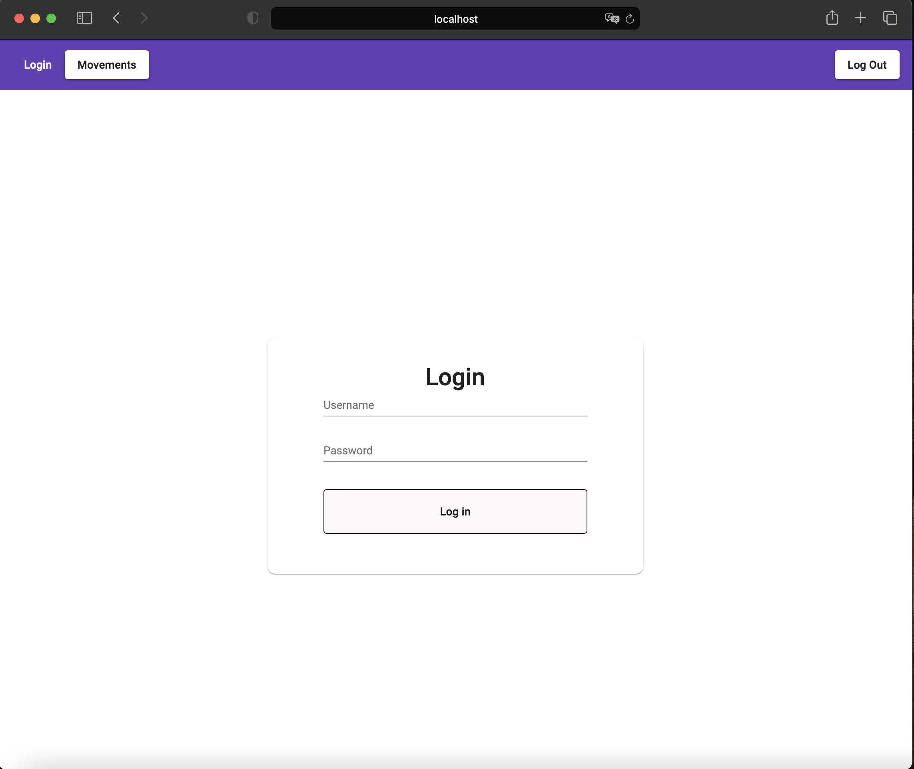
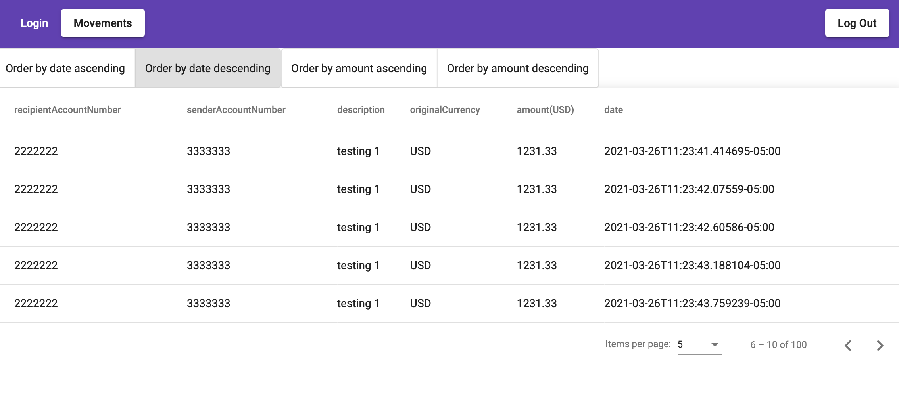

# Transfer web

Hello there
this is the front end app to consume the endpoint exposed in the transfer-api, 




I used Angular Material.

### TO RUN THE APP
Install node >= 15.11

```sh
npm run start
```
### IMPORTANT NOTE
No unit or integration test cases where implemented to save time (and them were not stated to), if you need me to include test, please let me know. 

